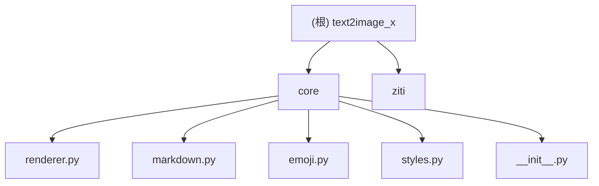

# 文字转图片-X (text2image_x)

> AstrBot 插件 — 将 Bot 文本回复渲染为图片，支持 Markdown 解析、Emoji（Twemoji）、自动撤回。

## 项目愿景

将聊天机器人的纯文本回复自动转换为高质量图片，提升可读性和表现力。支持 Markdown 富文本、彩色 Emoji、自适应布局，适配手机屏幕宽度（375px @2x）。

## 架构总览

```
[用户消息] → AstrBot → LLM 回复(纯文本)
                         ↓
            Text2ImagePlugin.on_decorating_result()
                         ↓
            TextRenderer.render(text)
              ├── parse_markdown()    → TextSegment 列表
              ├── EmojiHandler        → Twemoji CDN 下载/缓存
              ├── 布局计算(换行/分词)  → render_items
              └── PIL ImageDraw       → 临时 JPG → base64
                         ↓
              [发送图片消息 / 自动撤回]
```

**核心流水线**: Markdown 解析 → Emoji 处理 → 布局计算 → PIL 渲染 → base64 输出

**关键设计决策**:
- 渲染在异步线程池执行 (`asyncio.to_thread`)，不阻塞事件循环
- 并发渲染限流（`asyncio.Semaphore(3)`），防止内存暴涨
- 渲染器实例按配置指纹（`_build_renderer_cfg_fp`）缓存，配置变更时重建
- Emoji 三级缓存：内存 LRU → 磁盘文件 → CDN 下载，失败 TTL 防重复请求

## 模块结构图



## 模块索引

| 模块路径 | 语言 | 职责 | 入口文件 | 关键接口 |
|----------|------|------|----------|----------|
| `.` (根) | Python | AstrBot 插件入口、配置、事件钩子 | `main.py` | `Text2ImagePlugin`, `on_decorating_result()` |
| `core/` | Python | 文本渲染引擎核心 | `core/__init__.py` | `TextRenderer.render()`, `parse_markdown()`, `EmojiHandler.render_emoji()` |
| `ziti/` | 字体资源 | 字体文件存放目录 | — | — |

## 技术栈

| 类别 | 技术 | 版本要求 |
|------|------|----------|
| 运行时 | Python | 3.8+ |
| 图像处理 | Pillow (PIL) | >= 9.0.0 |
| 框架 | AstrBot API | — |
| Emoji 源 | Twemoji CDN (jsDelivr/MaxCDN/Twimg) | latest |
| 许可证 | AGPLv3 | — |

## 运行与开发

### 安装

```bash
# 作为 AstrBot 插件安装，将本目录放入 AstrBot 的插件目录
pip install -r requirements.txt
```

### 配置

所有配置项定义在 `_conf_schema.json`（24 项），通过 AstrBot 配置系统加载。主要配置项：

| 配置项 | 类型 | 默认值 | 说明 |
|--------|------|--------|------|
| `enable_render` | bool | true | 启用图片渲染 |
| `render_scope` | string | `llm_only` | 渲染范围: `llm_only` / `all_text` |
| `image_width` | int | 375 | 图片逻辑宽度 (px) |
| `image_scale` | int | 2 | 渲染倍数 (2x 高清) |
| `font_name` | string | Source_Han_Serif_SC_Light_Light.otf | 主字体 |
| `recall_enabled` | bool | false | 启用自动撤回 |
| `recall_time` | int | 30 | 撤回时间 (秒) |

### 本地测试

```bash
# 运行 emoji 缓存测试
python test_emoji_cache.py
```

## 测试策略

### 现有测试

- `test_emoji_cache.py` — Emoji 缓存功能集成测试（下载、磁盘缓存、二次命中）

### 测试缺口

- 核心渲染器 (`core/renderer.py`) 无单元测试
- Markdown 解析器 (`core/markdown.py`) 无独立测试
- 表格解析/序列化边界情况未覆盖
- 换行/分词算法的中日韩字符处理未测试

### 推荐测试框架

- `pytest` + `pytest-asyncio`（插件类测试需要异步支持）
- 渲染结果可用像素级快照对比（`pytest-pil` 或自定义断言）

## 编码规范

### 项目约定

- **语言**: 代码与注释使用 English，提交信息使用简体中文
- **行宽**: 无硬性限制，建议 120 字符
- **类型注解**: 使用 `typing` 模块注解公共接口
- **日志**: 使用 `astrbot.api.logger`，前缀 `[text2image-x]`

### 代码风格

```python
# 日志前缀约定
logger.info(f"[text2image-x] 插件已加载")

# 配置读取约定
self._cfg_bool("key", False)  # 兼容字符串 "true"/"false"
int(self.cfg().get("key", 0))  # 数值型配置

# 渲染器实例管理
cfg_fp = self._build_renderer_cfg_fp(cfg)  # 配置指纹
with self._renderer_lock:                    # 线程安全替换
    if self._renderer_cfg_fp != cfg_fp:
        self._renderer = TextRenderer(cfg, self._font_dir)
```

### 关键模式

1. **装饰器钩子**: 插件通过 `@filter.on_decorating_result(priority=-10)` 和 `@filter.on_llm_response(priority=100000)` 接入 AstrBot 事件管道
2. **配置指纹**: `_build_renderer_cfg_fp()` 将配置关键字段组成元组，用于判断是否需要重建渲染器
3. **并发控制**: 渲染通过 `asyncio.Semaphore(3)` 限流，在线程池执行 (`asyncio.to_thread`)
4. **临时文件清理**: 渲染生成的 JPG 在 base64 编码后立即删除

## AI 使用指引

向 AI (Claude/Codex) 描述本项目时的推荐提示：

```
这是一个 AstrBot 插件，功能是将 LLM 文本回复渲染为图片。
入口在 main.py 的 Text2ImagePlugin 类。
核心渲染逻辑在 core/renderer.py 的 TextRenderer.render() 方法。
Markdown 解析在 core/markdown.py。
Emoji 处理在 core/emoji.py（使用 Twemoji CDN，带三级缓存）。
字体文件放在 ziti/ 目录。
配置文件是 _conf_schema.json。
```

### 常见修改场景

| 场景 | 涉及文件 | 注意点 |
|------|----------|--------|
| 新增 Markdown 语法支持 | `core/markdown.py` → `core/styles.py` | 需同步更新 `INLINE_PATTERNS` 和 `TextSegment` 字段 |
| 调整渲染样式 | `core/renderer.py` | `render()` 中布局/绘制逻辑；`_build_line_layout()` 统一布局参数 |
| 新增配置项 | `_conf_schema.json` → `main.py` | schema 增项 → `_build_renderer_cfg_fp()` 加入指纹 key |
| 更换 Emoji 源 | `core/emoji.py` | 修改 `CDN_BASES` 列表和 `_get_twemoji_urls()` |
| 添加新字体 | `ziti/` 目录放入文件 | 插件自动扫描，无需改代码 |

---

## 变更记录 (Changelog)

| 日期 | 版本 | 变更内容 |
|------|------|----------|
| 2026-06-01 | — | 初始化 AI 上下文文档 (CLAUDE.md)；全仓扫描 100% 覆盖率；识别 2 个模块 |
